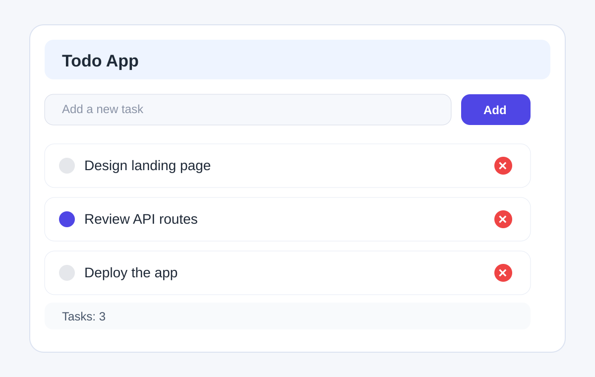

# Todo App with Express Server

A simple React + Vite todo application with a lightweight Express API for managing tasks. The app lets users add, complete, and delete todos while storing the data in memory on the server.

## Screenshot



## Features

- Add new tasks from the frontend form
- Mark tasks as complete or incomplete
- Delete tasks from the list
- Fetch all tasks from a backend API
- In-memory persistence for the current server session
- Built with React, TypeScript, Vite, and Express

## Tech Stack

- Frontend: React, TypeScript, Vite
- Backend: Express.js
- Styling: CSS

## Project Structure

```bash
.
├── public/
│   └── todo-app-screenshot.svg
├── src/
│   ├── App.tsx
│   ├── App.css
│   ├── main.tsx
│   └── index.css
├── server.cjs
├── package.json
├── vite.config.ts
├── tsconfig.json
├── index.html
└── README.md
```

## Run the app

1. Install dependencies:

```bash
npm install
```

Or with pnpm:

```bash
pnpm install
```

2. Start the Express API server:

```bash
node server.cjs
```

This runs the backend on:

```bash
http://localhost:3000
```

3. Start the frontend development server:

```bash
npm run dev
```

Then open:

```bash
http://localhost:5173
```

## API example

The app communicates with the server through these endpoints:

### Get all todos

```bash
curl http://localhost:3000/api/todos
```

Example response:

```json
[
  { "id": 1, "title": "Write project summary", "taskDone": false },
  { "id": 2, "title": "Review API route", "taskDone": true }
]
```

### Create a todo

```bash
curl -X POST http://localhost:3000/api/todos \
  -H "Content-Type: application/json" \
  -d '{"title":"Plan sprint tasks","taskDone":false}'
```

Example response:

```json
{
  "id": 3,
  "title": "Plan sprint tasks",
  "taskDone": false
}
```

### Update a todo

```bash
curl -X PUT http://localhost:3000/api/todos/1 \
  -H "Content-Type: application/json" \
  -d '{"title":"Write project summary","taskDone":true}'
```

### Delete a todo

```bash
curl -X DELETE http://localhost:3000/api/todos/1
```

## Example usage flow

```text
User opens the app
  ↓
Adds a new task like "Buy groceries"
  ↓
Frontend sends POST request to /api/todos
  ↓
Server stores the task in memory
  ↓
Todo list updates immediately in the UI
```

## Notes

- The todo list is stored in memory, so it resets when the server restarts.
- This project is ideal for learning how React frontend state and a small Express backend can work together.
- The app is easy to extend with database storage, filtering, or edit-in-place capabilities.

## License

This project is for learning and demonstration purposes.
